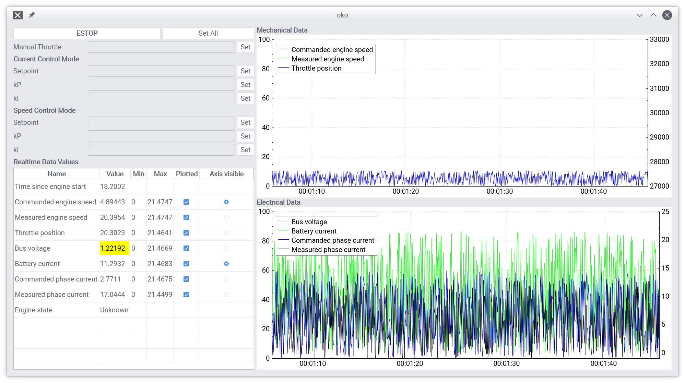

# What’s this?



Oko is a realtime telemetry visualization system.
Oko wirelessly acquires data over Bluetooth using the RFCOMM protocol, and displays it in realtime using charts and tables.

## Features
1. Realtime updating: oko will display all the data you can throw at it with minimal latency
2. Lightweight: oko can be built as a 12MB static binary and consumes approximately 2-3% CPU and 15MB RAM while running
3. Cross-platform: oko has been tested on Windows, GNU/Linux, and should run on macOS
4. Automatic warnings: oko allows you to define warning thresholds and will warn you when values exceed thresholds by highlighting the data
5. Automatic scaling: oko handles multiple data streams on different scales intelligently by automatically scaling them to fit the charts
6. Logging: all of the data that passes through oko is automatically logged to a folder of your choosing for later analysis or archiving

# Quick start

1. Make note of the MAC address of the target Bluetooth module and change it on the `MACAddress` field of `config.toml` if needed
2. Change the path of the log folder to a suitable location in `config.toml` if needed.
3. Verify that the `dataStream` names, positions, warning thresholds and typical values in `config.toml` correspond to the `dataStreams` coming off the Bluetooth module. Make changes if needed.
4. Start up the target system.
5. Ensure that your computer is paired to the target's Bluetooth module (not connected, just paired).
6. Start up oko and wait for it to connect to the Bluetooth module. This should only take a few seconds.
7. Observe data from the target system.

# Configuration

Oko expects there to be a config.toml file in the location of its executable.
This config.toml file specifies important application settings as well as the format of the data from the target system.
Note: oko will fail to start if config.toml is malformed or missing on initialization!

## Application settings

Application settings dictate important parameters that oko needs to know in order to function properly.

```toml
[application]
MACAddress        = "00:XX:00:XX:00:XX" # The MAC address of the target system
plotWidth         = 40                  # The width of the plots in seconds
logFolderPath     = "./logs/"           # Where the files containing logged data will be stored
```

## Stream configuration

Oko works on the principle of datastreams.
Suppose you are testing an internal combustion engine; you might want to view several different data items such as engine speed, fuel consumption, alternator output, etc. simultaneously.
Each one of these data items is assigned it's own datastream.
For the engine example, you might want to describe the datastreams like so:

```toml
[[dataStream]]
name              = "Engine speed" # The name that will be displayed in oko
type              = "Mechanical"   # Dictates which plot the stream will be plotted in: mechanical, electrical, or time.
colour            = "red"          # Graph line color: red, green, blue, black, cyan, magenta
position          = 0              # Position in the RFCOMM line
multiplier        = 1000           # Multiply the incoming value by this number, i.e. if you want to go from kRPM to RPM
warningThresholds = [750, 8500]    # Threshold at which oko will warn about unusual data
typicalValues     = [0, 9000]      # The typical range of the datastream

[[dataStream]]
name              = "Fuel consumption rate"
type              = "Mechanical"
colour            = "blue"
position          = 1
multiplier        = 0.05
warningThresholds = [0, 30]
typicalValues     = [0, 35]

[[dataStream]]
name              = "Alternator output"
type              = "Electrical"
colour            = "green"
position          = 2
multiplier        = 1
warningThresholds = [-50, 50]
typicalValues     = [-75, 75]
```

Oko does not impose any limit on the number of datastreams.

# Troubleshooting

Some common problems encountered during testing are listed here along with fixes.
If your problem isn’t listed here and/or doesn’t seem to be a hardware problem, have the software guys take a look.

## Data transmission doesn’t work

If the oko doesn’t appear to be receiving data ensure that communication between the target system and its Bluetooth device is functioning properly.
There are typically blinking/solid lights during normal operation, if those are missing it points to a hardware configuration problem.
Ensure your computer is paired to the dongle when starting up oko; barring that ensure that Bluetooth is working properly on your computer.

## Crash on program start

If oko doesn’t open/crashes immediately after starting and it doesn’t seem to be a hardware configuration problem, it’s probably a problem in your configuration file.
Make sure you didn’t leave unclosed braces, missing equalities or anything else that breaks TOML format.
Otherwise, revert to the latest working version, or if that doesn’t work use the default configuration file from `git`.

## Problems reconnecting

If oko is not reconnecting after a dropped connection, either wait a little longer or just turn off your Bluetooth device and the Bluetooth module and restart the testing regime manually.
It has taken up to 40 seconds for oko to reconnect to the Bluetooth module during testing so you’re probably better off just manually restarting if you’re in a rush.

# Development

## Documentation

Oko is fully documented with Doxygen.
To view the docs in HTML format, follow the instructions for building with CMake below and simply invoke `make docs` upon completions.
The documentation will be automatically generated and placed in the `docs` subdirectory.

## Building from source

There’s two options for building oko from source: using QMake or CMake.
If you’re just trying to get a quick build and get on with your life, use QMake.

### Building with QMake

You’ll need QtCreator (which should include a Qt installation) for this.
Look up how to install it, it’s easy. Once you’ve got QtCreator open, find the project folder on your device and open the `oko.pro` file.
Once it’s open, just click the green “play” button at the bottom left which starts a build.

### Building with CMake

I used CMake as my build system during development to save me from having to keep QtCreator open all the time.
If you're just trying to add a fix or small feature to the codebase you're best off just using QMake.

That being said, CMake is easy to use.

#### In the terminal

```bash
# These instructions assume you start in the root of the project
mkdir build
cd build
cmake ..
make
```
Warning: I was lazy with my `CMakeLists.txt` and used recursive globbing of source files instead of hardcoding them.
The downside to this is that when files are added/removed from the source tree the makefiles that CMake generates don't reflect those changes.
This means that you'll have to regenerate the CMake configuration like so:

```bash
# Assuming you're already in oko/build...
rm -rf *
cmake ..
make
```

#### In QtCreator
QtCreator has good CMake support now, and you can use it for your builds by opening the `CMakeLists.txt` file instead of `oko.pro` in the QtCreator project selection dialog.
I haven't tested this extensively so no guarantees of it working, especially on Windows.
